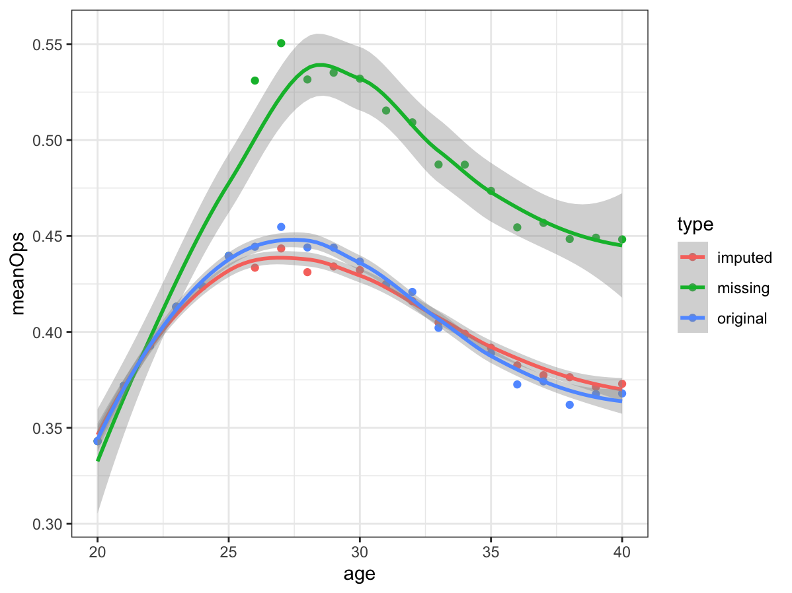

# Background

<!-- date: "`r format(Sys.time(), '%B %d, %Y')`" -->
<!-- output: -->
<!--   xaringan::moon_reader: -->
<!--     nature:  -->
<!--       highlightStyle: github -->
<!--       highlightLines: true -->
<!--       highlightSpans: true -->
<!--       countIncrementalSlides: false -->
<!--       ratio: '16:9' -->
<!--       self_contained: true -->
<!--       slideNumberFormat: "%current%" -->

```{r setup, include=FALSE}
knitr::opts_chunk$set(echo = FALSE,
                      warning = FALSE,
                      message = FALSE)
```

```{r}
library(Lahman)
library(tidyverse)

baseball <- 
  left_join(Batting, People, by = "playerID") %>% 
  mutate(age = ifelse(birthMonth >= 7,
                      yearID - birthYear - 1, yearID - birthYear)) %>%
  filter(age %in% 20:40) %>% 
  mutate(OBP = (H + BB + HBP) / (AB + BB + HBP + SF),
         SLG =  (H + X2B + 2*X3B + 3*HR) / AB,
         OPS = OBP + SLG) %>% 
  filter(!is.na(OPS))
```

-   Aging curve: performance throughout a career

-   Ability vs. age

-   Topics to explore: peak, rate of change, shape,... 

```{r, fig.width=3.6, fig.height=2.4, fig.pos="center"}
data.frame(
  Age = 21:39,
  Performance = c(25.8, 27.5, 29.8, 31.7, 31.1, 31.2, 31.6, 27.7, 29.7, NA, 22.1, 29.4, 27.8, 25.2, NA, NA, NA, 20.7, 19.3)
) %>% 
  ggplot(aes(x = Age, y = Performance)) + 
  geom_point(color = "red", size = 2) + 
  geom_smooth(se = FALSE) + 
  scale_x_continuous(breaks = seq(20, 40, by = 4))+ 
  theme_bw() + theme(text = element_text(size=7))
```

---

# Aging Curve in Sports Literature

-   Morris (1983): Used parametric empirical Bayes procedures to estimate Ty Cobb's BA trajectory

-   Albert (1992): Used a Poisson random effects model to smooth the career trajectory of a batter's HR rates.

-   Albert (1999): Used a quadratic aging function to compare the best home run hitters.

-   Berry et. al. (1999): Compared abilities of athletes from different eras in baseball, hockey, and golf.

-   Schall and Smith (2000): Investigated baseball hitters and pitchers performance during the course of their careers. Used logit model to predict survival probabilities of players.

---

# Aging Curve in Sports Literature

-   Fair (2007): Estimated age effects in athletic events (track and field, swimming) and chess

-   Fair (2008): Estimated age effects in baseball

-   Wakim and Jin (2014): Functional Data Analysis of Aging Curves in Sports

-   Vaci et. al (2019): Large data and Bayesian modeling - aging curves of NBA players

---

# Player drop-out as a missing data problem

-   Missing data: MCAR, MAR, MNAR

-   Where could missingness occur for a player?

    -   Beginning of career 

    -   End of career

---

# Data

-   Lahman database: `http://www.seanlahman.com/baseball-archive/statistics`

    -   `Lahman` `R` package

    -   `Batting` and `People` tables

---

\scriptsize

```{r, echo = TRUE}
library(Lahman)
```

```{r, echo = TRUE, comment=""}
colnames(Batting)
colnames(People)
```

\normalsize

---

# Method

-   Fit a model

-   Generate "fake" players careers

-   Create different drop-out mechanisms

-   Impute the data

-   Go back to the real MLB data

---

```{r}
library(lme4)
mixed_mod <- lmer(OPS ~ poly(age, 3, raw = TRUE) + (1|playerID), data = baseball)
```

# Model and Simulation

-   Model: `OPS ~ poly(age, 3) + (1|playerID)`

```{r}
mod1 <- lmer(OPS ~ poly(age, 3, raw = TRUE) + (1|playerID), data = baseball)
randeff <- as.data.frame(VarCorr(mod1))

set.seed(12345)
sim <- function(){
  age <- data.frame(age = 20:40)
  pred <- predict(mixed_mod, age, re.form = NA)
  
  shift <- rnorm(1, 0, randeff[1,5]) # new player- strength, shift
  eps <- rnorm(nrow(age), 0, randeff[2,5]) # variability across szn
  
  career <- pred + shift + eps
  return(career)
}

mylist <- list()
for(i in 1:9){
  mylist[[i]] <- data.frame(player = i, ops = sim(), age = 20:40)
}

do.call(rbind, mylist) %>% 
  mutate(player = as.factor(player)) %>% 
  ggplot(aes(x = age, y = ops, col = player)) + 
  geom_point() + geom_smooth(se = FALSE) + theme_bw() +  
  theme(text = element_text(size=7))
```

-   There's a small problem...

---

# A better approach...

-   Use a transformation: arcsin transformation

```{r}
scaled <- baseball %>% 
  filter(OPS < 1.422) %>% 
  select(playerID, age, OPS) %>% 
  mutate(scaledOPS = OPS/max(OPS),
         arcsin = asin(sqrt(scaledOPS)))

maxOPS <- max(scaled$OPS)

mixed_mod <- lmer(arcsin ~ poly(age, 3, raw = TRUE) + (1|playerID), data = scaled)
randeff <- as.data.frame(VarCorr(mixed_mod))

set.seed(123)
sim <- function(){
  age <- data.frame(age = 20:40)
  pred <- predict(mixed_mod, age, re.form = NA)
  
  shift <- rnorm(1, 0, randeff[1,5]) # new player- strength, shift
  eps <- rnorm(nrow(age), 0, randeff[2,5]) # variability across szn
  
  career <- pred + shift + eps
  return(career)
}


mylist <- list()
for(i in 1:1000){
  mylist[[i]] <- data.frame(player = i, arcsin = sim(), age = 20:40)
}

simdata <- do.call(rbind, mylist)

simdata <- mutate(simdata, ops = round(maxOPS*sin(arcsin)^2, 5))


simdata[1:189,] %>% 
  mutate(player = as.factor(player)) %>% 
  ggplot(aes(x = age, y = ops, col = player)) + 
  geom_point() + geom_smooth(se = FALSE) + theme_bw() +
  theme(text = element_text(size=7))
```

---

# Drop-out rules

-   If a player is 35 and his OPS is below a given threshold, he retires

-   If a player is 25 and OPS is below a given threshold, then drop (i.e. player is not good enough to remain in the league)

-   Drop players at the start of their careers due to low performance, but allow them to come back.

-   At ages 30 and 35, 25% and 35% of players randomly retire. 

---

# Comparing drop-outs

```{r, fig.width=4.5, fig.height=3}
drop_end1 <- simdata %>% 
  filter(age == 35 & ops < 0.2)

drop_end2 <- simdata %>% 
  filter(player %in% drop_end1$player) %>% 
  filter(age >= 35)

drop_end <- anti_join(simdata, drop_end2) %>% mutate(type = "End_of_career")

# drop out at the start of career
# age 25 ops < 0.3, not good enough to remain in the league (go overseas etc.)

drop_start1 <- simdata %>% 
  filter(age == 25 & ops < 0.2)

drop_start2 <- simdata %>% 
  filter(player %in% drop_start1$player) %>% 
  filter(age > 25)

drop_start <- anti_join(simdata, drop_start2) %>% mutate(type = "Start_of_career")

# Start: continue to be in minor league

dropstart1 <- simdata %>% 
  filter(age == 23 & ops < 0.2)

dropstart2 <- simdata %>% 
  filter(player %in% dropstart1$player) %>% 
  filter(age <= 23)

dropstart <- anti_join(simdata, dropstart2) %>% mutate(type = "Start_come_back")

# at age 30, 25% retire
players <- unique(simdata$player)
x <- sample(players, length(players)/4)

dropAge30 <- simdata %>% 
  filter(player %in% x) %>% 
  filter(age >= 30)

# age age 35, 10% more retire (35% total)
# y <- sample(setdiff(players, x), length(players)/10)
# 
# dropAge35 <- simdata %>% 
#   filter(player %in% y) %>% 
#   filter(age >= 35)
# 
# drop_30_35 <- anti_join(simdata, union(dropAge30, dropAge35)) %>% mutate(type = "Drop_ages_30_35")


drop_30 <- anti_join(simdata, dropAge30) %>% mutate(type = "Drop_age_30")

# at age 35, 50% retire
x35 <- sample(unique(simdata$player), length(players)/2)

dropAge35 <- simdata %>% 
  filter(player %in% x35) %>% 
  filter(age >= 35)

drop_35 <- anti_join(simdata, dropAge35) %>% mutate(type = "Drop_age_35")


# # middle of career
# 
# drop_mid <- simdata %>% 
#   filter(!(age %in% 26:33 & ops < 0.1)) %>% 
#   mutate(type = "Mid_career_injury")

simdata %>% 
  mutate(type = "Full_data") %>% 
  full_join(drop_end) %>% 
  full_join(drop_start) %>% 
  full_join(dropstart) %>% 
  full_join(drop_30) %>% 
  full_join(drop_35) %>% 
  # full_join(drop_mid) %>% 
  group_by(type, age) %>% 
  summarise(meanOps = mean(ops)) %>% 
  ggplot(aes(x = age, y = meanOps, col = type)) +
  geom_point() + geom_smooth(method = "loess") + 
  theme_bw() +
  theme(text = element_text(size=7))
```


---

# Imputation

-   Drop-out method: 25 low and out

{width=85%}

---

# More exciting things to come...

\vspace{-30mm}

-   Try with real MLB data

-   Extend to other sports?

-   GitHub repo: `https://github.com/qntkhvn/agingcurve`
